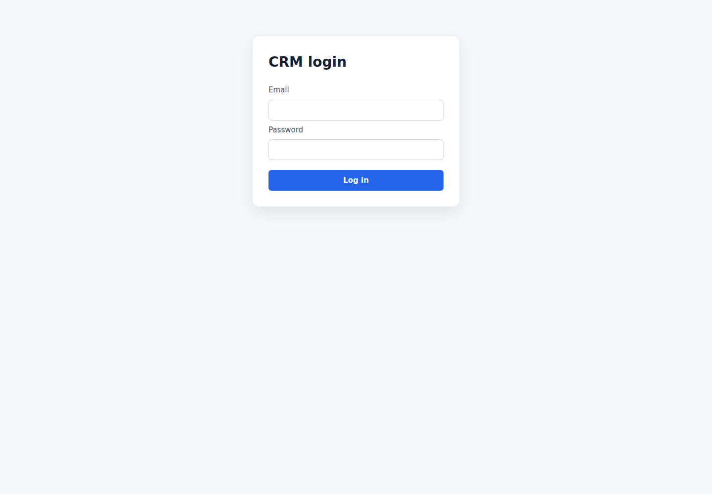
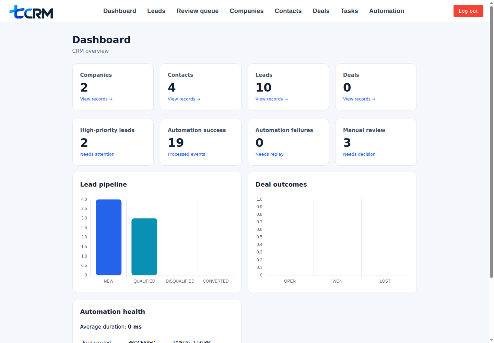
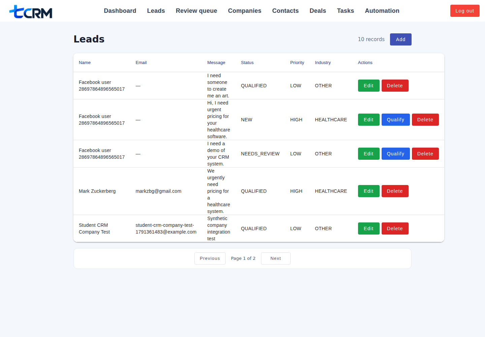
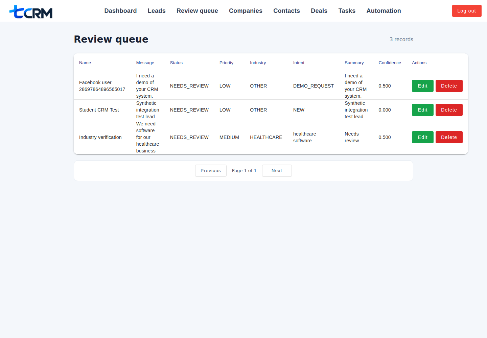
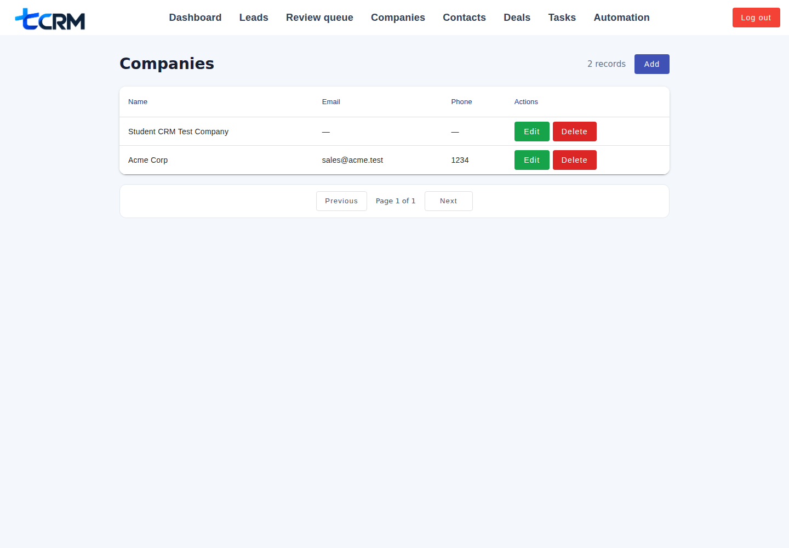
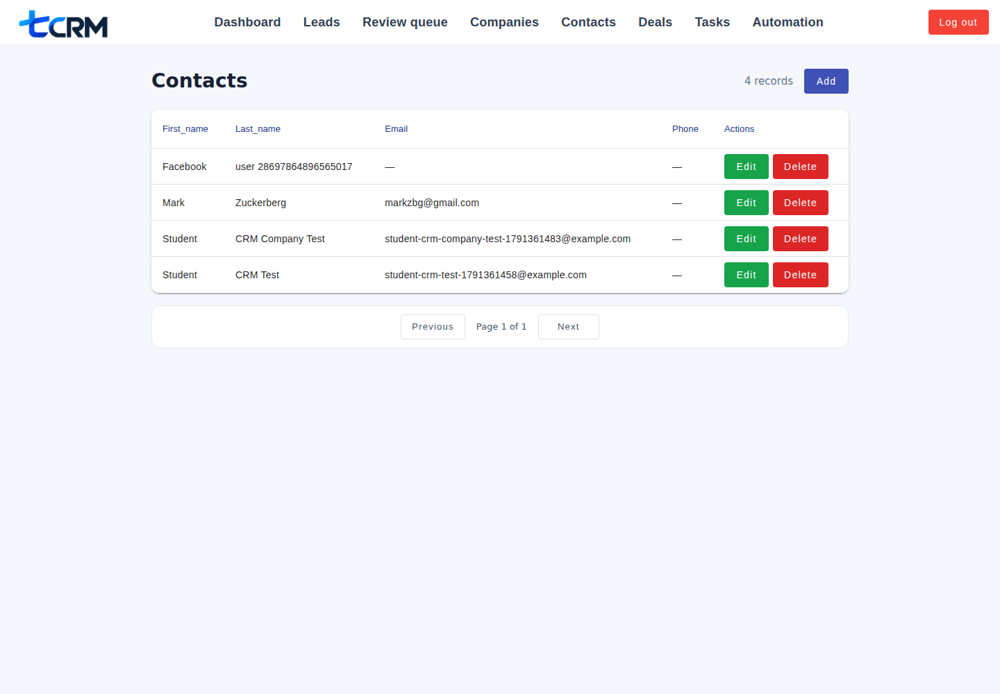
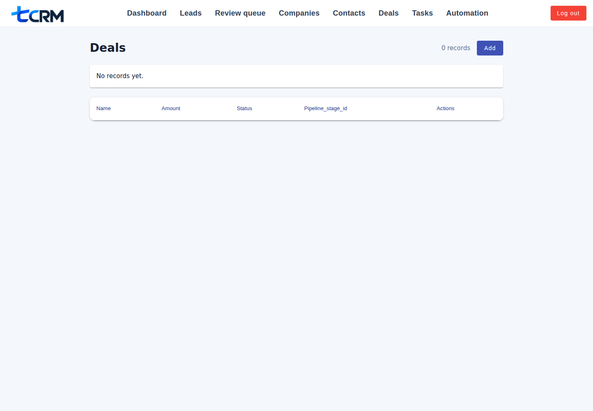
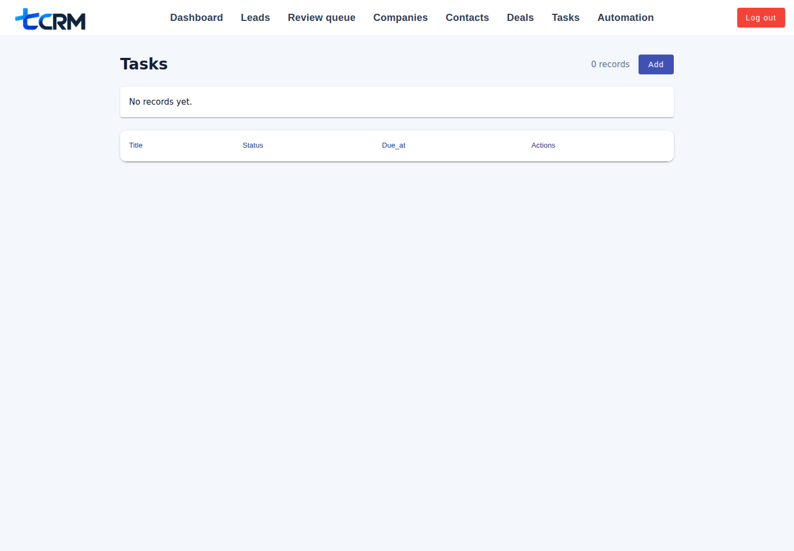
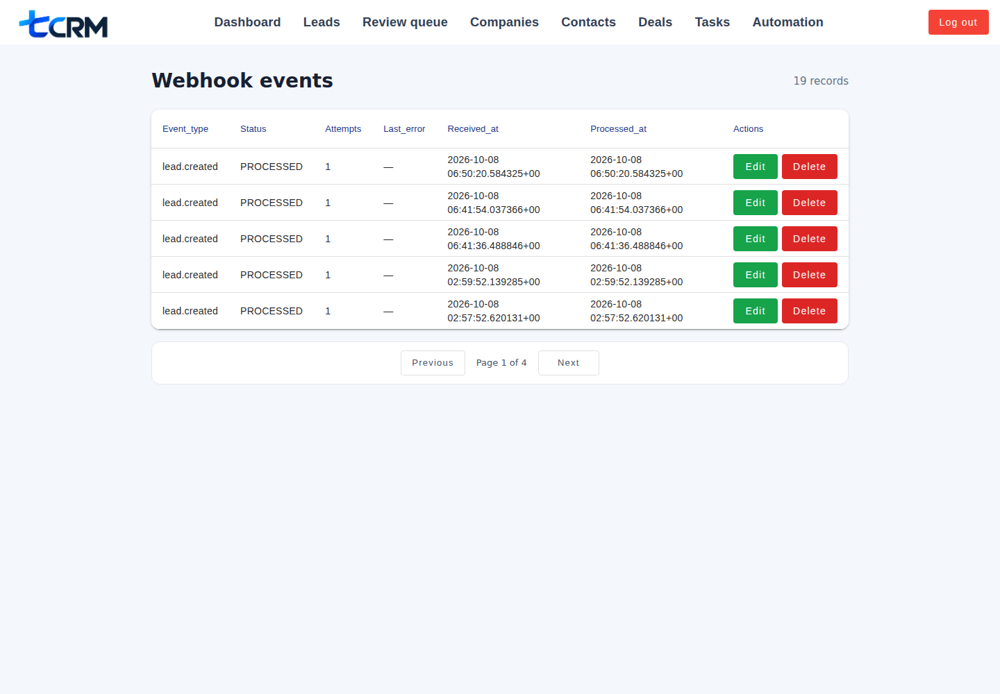

# AI-Powered CRM Automation Platform

A small portfolio CRM demonstrating Angular, a PHP/PostgreSQL API, n8n workflow orchestration, local AI classification, HubSpot sync, Discord alerts, and Facebook Messenger lead intake.

## Run locally

Requirements: Docker and Docker Compose. Copy `.env.example` to `.env` and set the values you use, especially `CRM_API_TOKEN`, `DISCORD_WEBHOOK_URL`, and `N8N_WEBHOOK_URL`.

```bash
./dev.sh
```

Frontend source is mounted into Docker, so edits under `frontend/` reload automatically. Rebuild only after changing dependencies or Docker configuration.

Open:

- Frontend: http://localhost:4200
- Backend health: http://localhost:8001/health
- AI health: http://localhost:8000/health
- n8n: http://localhost:5678

Set `N8N_WEBHOOK_URL` in `.env` to the n8n webhook URL. Lead creation stores a
`lead.created` event and retries delivery up to three times. Failed events can
be retried with `POST /api/webhook-events/{id}?action=retry`.
Leads below `CLASSIFICATION_REVIEW_THRESHOLD` (default `0.7`) appear in the
Angular Review queue, with the original AI result preserved in `ai_original`.
Qualified leads can be synced with `POST /api/leads/{id}?action=hubspot-sync`.
HubSpot rate limits and temporary server failures retry up to three times.

## Demo flow

1. Log in at `http://localhost:4200`.
2. Create a lead, or message the connected Facebook Page during Meta development testing.
3. Watch n8n classify the lead and update the CRM.
4. Check Discord for high-priority or manual-review alerts.
5. Mark a lead qualified to trigger HubSpot sync when `HUBSPOT_ACCESS_TOKEN` is configured.
6. Open **Automation** to inspect failed webhook events and replay them.

See [`docs/demo-script.md`](docs/demo-script.md) for a short presentation walkthrough.

## Screenshots



















## Integrations

- **Meta Messenger:** development-mode Page messages become CRM leads through `/api/meta/webhook`. The test setup uses a temporary HTTPS tunnel; do not use that tunnel for production.
- **n8n:** import [`automation/n8n/lead-created.json`](automation/n8n/lead-created.json) and [`automation/n8n/automation-failure.json`](automation/n8n/automation-failure.json), then activate both workflows.
- **Discord:** set `DISCORD_WEBHOOK_URL` for high-priority, manual-review, and automation-failure notifications.
- **HubSpot:** set `HUBSPOT_ACCESS_TOKEN` to enable sync when a lead becomes `QUALIFIED`.

## Design notes

Symfony is not required by the current implementation; the backend is a small PHP API using PDO and migrations. n8n owns workflow sequencing, while the backend remains the source of truth for CRM data and persisted webhook state.

AI output is bounded to intent, priority, industry, summary, and confidence. It cannot authorize users, decide retry rules, or perform irreversible actions. Low-confidence output goes to human review.

Webhook delivery is at-least-once: event IDs are persisted, duplicates are ignored, retries are bounded with exponential backoff, and failed events can be replayed manually. A production deployment should replace the temporary tunnel with managed HTTPS ingress and durable background workers.

Example payloads and classifier fixtures are in [`docs/`](docs/) and [`ai/classifier/fixtures.json`](ai/classifier/fixtures.json).

## Project structure

- `frontend/` — Angular application
- `backend/` — PHP API and database migrations
- `ai/classifier/` — AI classification service
- `docker-compose.yml` — local development services

To stop the stack:

```bash
docker compose down
```
